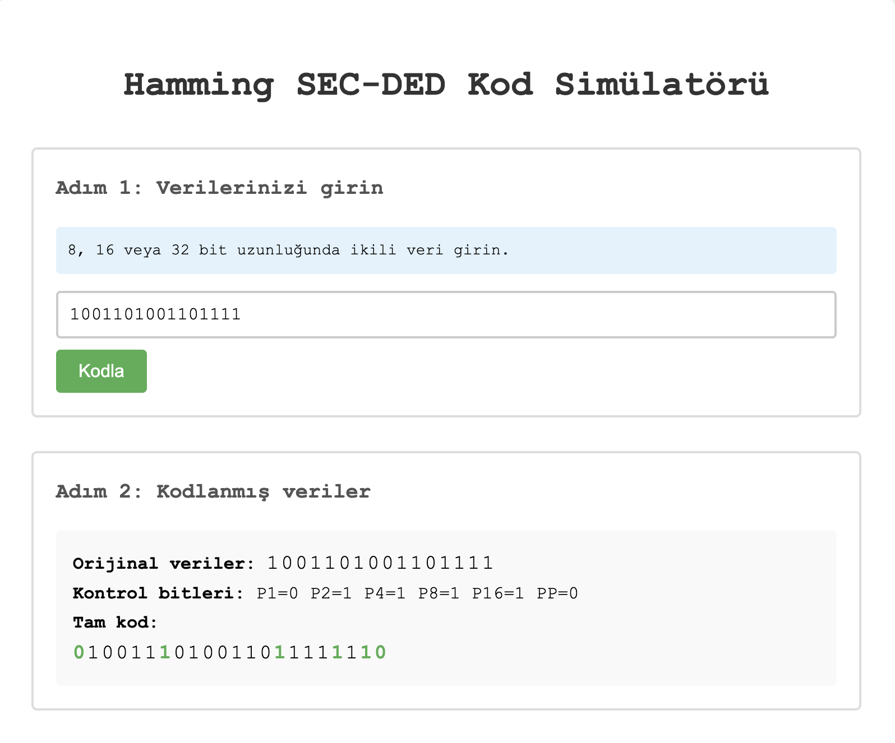
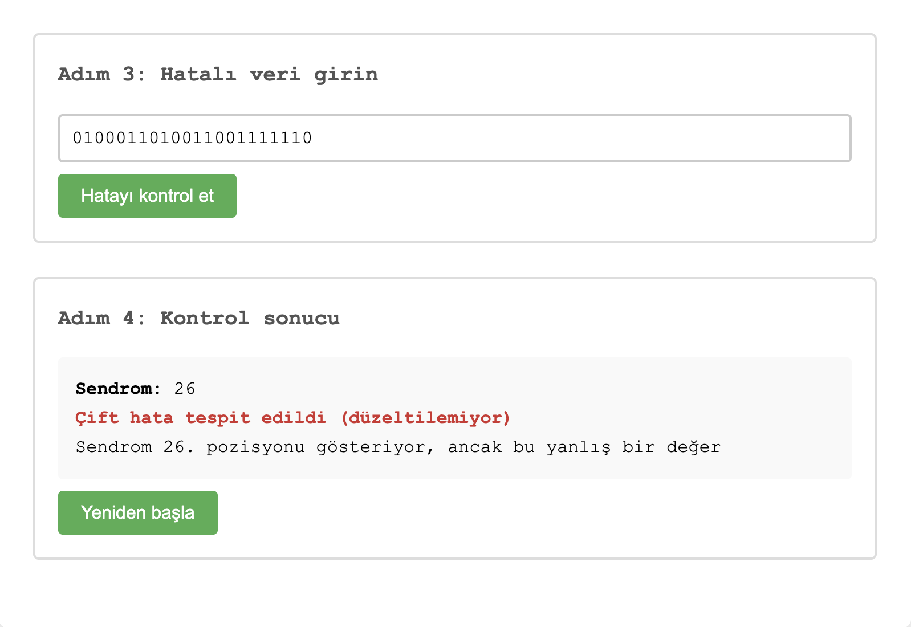

# Hamming SEC-DED Simulator

A web-based Hamming SEC-DED code simulator developed for the BLM230 Computer Architecture course.

This project demonstrates how SEC-DED (Single Error Correction, Double Error Detection) error correction codes work using binary data encoding, parity bit calculation and syndrome-based error detection.

---

## Live Demo

[Open Simulator](https://umkhanov.github.io/hamming-sec-ded-simulator)

---

## Demo Video

[Watch Demo Video](https://youtu.be/2zVlpZiWLIo)

---

## Features

- Hamming SEC-DED encoding
- Single-bit error correction
- Double-bit error detection
- Syndrome calculation
- Support for:
  - 8-bit data
  - 16-bit data
  - 32-bit data
- Interactive step-by-step simulation
- Web-based interface

---

## Technologies Used

- HTML5
- CSS3
- JavaScript

---

## How It Works

### Encoding Process

1. User enters binary data
2. Parity bits are calculated
3. Control bits are inserted into their positions
4. Global parity bit (PP) is added
5. Encoded data is generated

### Error Detection Process

1. User enters corrupted data
2. Syndrome value is calculated
3. SEC-DED algorithm analyzes the error
4. The system:
   - corrects single-bit errors
   - detects double-bit errors

---

## Screenshots

<p align="center">
  
  
</p>

---

## Supported Error Detection

| Error Type | Supported |
|---|---|
| Single-bit Error Correction | ✅ |
| Double-bit Error Detection | ✅ |
| Double-bit Error Correction | ❌ |

---

## Project Structure

```text
hamming-sec-ded-simulator/
│
├── screenshots/
│   ├── encoding-view.png
│   └── error-detection.png
│
├── index.html
├── README.md
└── .gitignore
```

---

## Example Input

```text
1001101001101111
```

---

## Educational Purpose

This project was developed as part of a Computer Architecture course assignment to demonstrate the implementation and behavior of Hamming SEC-DED error correction algorithms.

---

## Author

Magomed Umkhanov  
Computer Engineering Student
